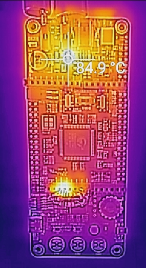
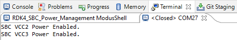
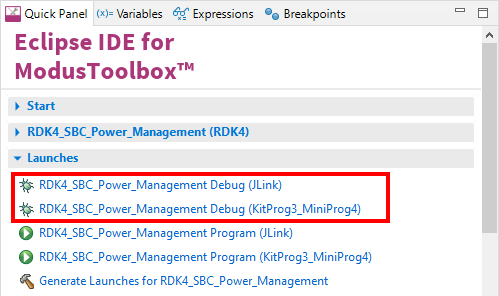

# RDK4 TLE9262-3BQX SBC Power Management Example

Rutronik Development Kit 4 Programmable System-on-Chip CY8C4149AZE-S598 "SBC Power Management" Code Example. 

 

System Basis Chip TLE9262-3BQX power supply VCC3 under test. Arduino 3.3V power terminal loaded with 14.5 Ohms resistor.

## Requirements

- [ModusToolbox™ software](https://www.cypress.com/products/modustoolbox-software-environment) v3.0

### Using the code example with a ModusToolbox™ IDE:

1. Import the project: **File** > **Import...** > **General** > **Existing Projects into Workspace** > **Next**.
2. Select the directory where **"RDK4_SBC_Power_Management"** resides and click  **Finish**.
3. Update the libraries using a **"Library Manager"** tool.
4. Select and build the project **Project ** > **Build Project**.

### Operation

The firmware example uses KitProg3 Debug UART for debug output. A Green LED will blink if hardware initialization succeeds. The System Basis Chip power supplies VCC2 [+5V] and VCC3 [+3.3V] are held constantly ON. The watchdog is 'fed' every 500 milliseconds to keep the System Basis Chip in Normal Mode.

### Debugging

If you successfully have imported the example, the debug configurations are already prepared to use with a the KitProg3, MiniProg4, or J-link. Open the ModusToolbox™ perspective and find the Quick Panel. Click on the desired debug launch configuration and wait for the programming to complete and the debugging process to start.

## Legal Disclaimer

The evaluation board including the software is for testing purposes only and, because it has limited functions and limited resilience, is not suitable for permanent use under real conditions. If the evaluation board is nevertheless used under real conditions, this is done at one’s responsibility; any liability of Rutronik is insofar excluded. 

